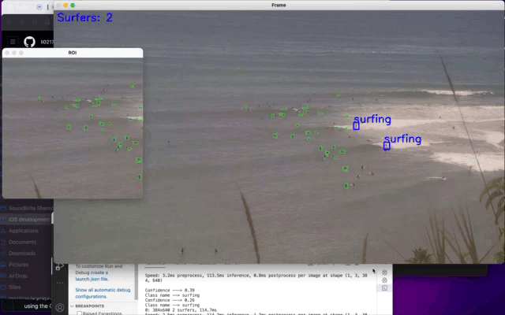

# SurfSense
Use computer vision to quantify surf condition based on video stream 

### Summary:

**Problem Statement**: 
Surfers struggle to accurately assess local surfing conditions due to unreliable surf predictions from services like Surfline. Assessing the suitability of a surfing day becomes challenging.

**Solution**: 
Develop a computer vision system utilizing beach surveillance video data to quantify the current wave capture rate and crowdedness of specific regions of interest. This system provides surfers with an objective overview of current conditions, enabling them to make informed decisions about surfing. Users can query their preferred beach by providing the required input: the video feed from the beach camera.

